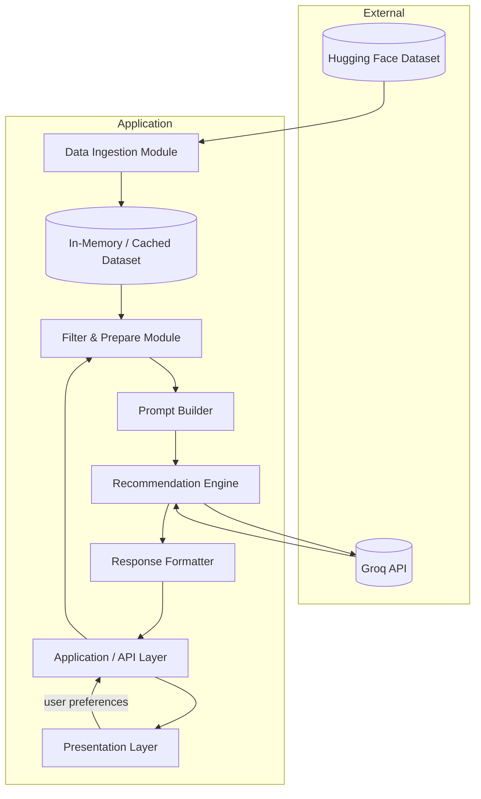
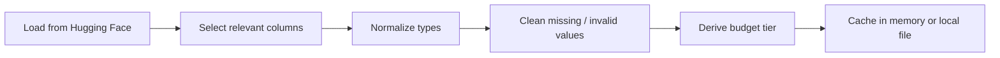
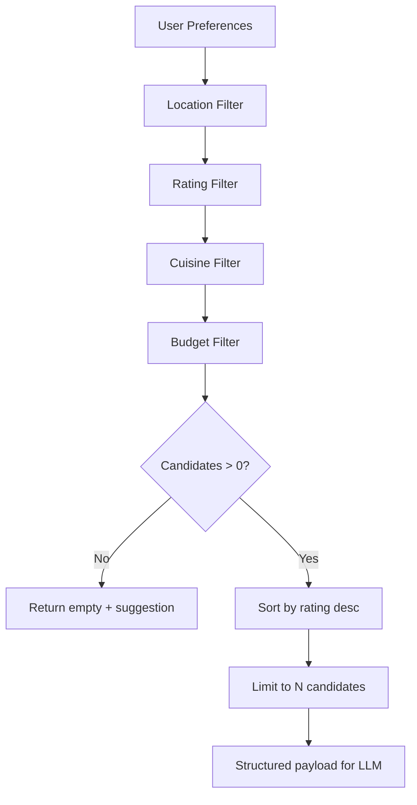
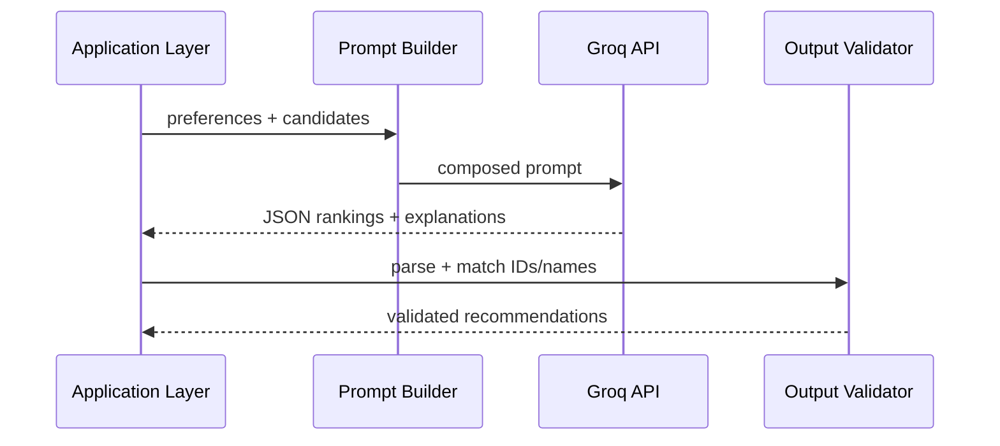
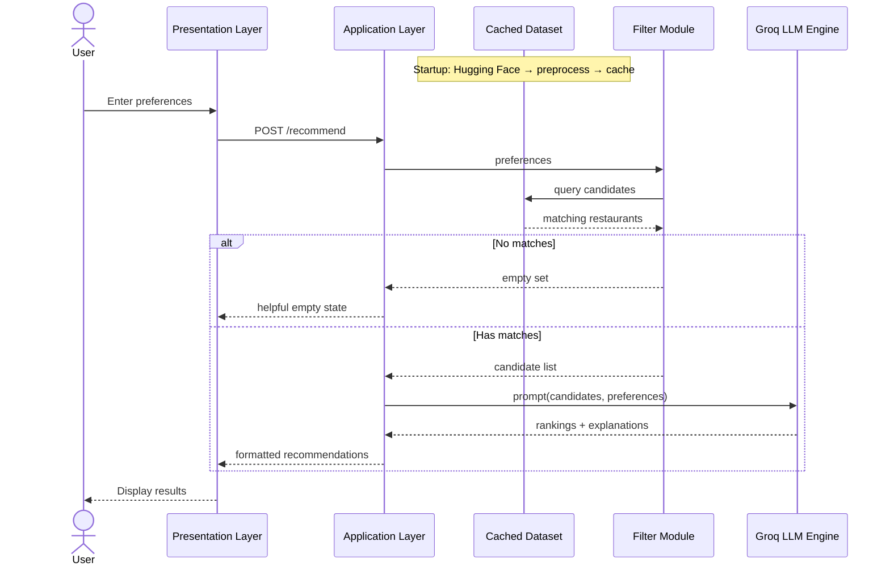
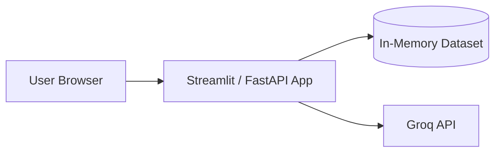

# Architecture: AI-Powered Restaurant Recommendation System

> Derived from [context.md](context.md) — Zomato-inspired recommendation service combining structured restaurant data with LLM-powered reasoning via **Groq**.

---

## 1. Architecture Overview

The system follows a **layered pipeline architecture**: ingest and normalize restaurant data once, accept user preferences at runtime, filter candidates deterministically, then delegate ranking and explanation to an LLM hosted on **Groq's ultra-low-latency inference platform**. Structured filtering happens **before** the LLM call to reduce token cost, improve latency, and ground every response in real data.



### Design Principles

| Principle | Rationale |
|-----------|-----------|
| **Filter first, reason second** | Hard constraints (location, budget, min rating) are applied in code; the LLM ranks and explains within a bounded candidate set. |
| **Grounded recommendations** | Every recommendation must map to a real row in the dataset — no hallucinated restaurants. |
| **Separation of concerns** | Data loading, filtering, prompting, and UI are independent modules with clear interfaces. |
| **Fail gracefully** | Empty filter results, LLM timeouts, and invalid input each have explicit fallback behavior. |

---

## 2. System Layers

### 2.1 Presentation Layer

**Responsibility:** Collect user preferences and render recommendation results.

**Components:**

- **Preference Form** — Inputs for location, budget tier, cuisine, minimum rating, and free-text additional preferences (e.g., "family-friendly", "quick service").
- **Results View** — Cards or list items showing restaurant name, cuisine, rating, estimated cost, and AI-generated explanation.
- **Loading & Error States** — Spinners during LLM calls; user-friendly messages when no matches or API failures occur.

**Suggested interface options (choose one):**

| Option | Pros | Cons | Recommended For |
|--------|------|------|------------------|
| **Streamlit** (recommended) | Fast to build, Python-native, rich widgets | Less customizable styling | MVP / demo / milestone |
| React + FastAPI | Full UX control, production-grade | More setup, two codebases | Production |
| CLI | Simplest for backend testing | Not end-user friendly | Dev / debugging only |

**Input validation (client + server):**

- Location: non-empty string or enum from known cities in dataset
- Budget: one of `low` | `medium` | `high`
- Cuisine: string or multi-select
- Minimum rating: float in `[0, 5]`
- Additional preferences: optional free text

---

### 2.2 Application / API Layer

**Responsibility:** Orchestrate the recommendation workflow; expose a single entry point for the UI.

**Core endpoint (conceptual):**

```
POST /recommend
```

**Request body:**

```json
{
  "location": "Bangalore",
  "budget": "medium",
  "cuisine": "Italian",
  "min_rating": 4.0,
  "additional_preferences": "family-friendly, outdoor seating"
}
```

**Response body:**

```json
{
  "summary": "Here are three Italian spots in Bangalore that fit a medium budget...",
  "recommendations": [
    {
      "rank": 1,
      "name": "Example Bistro",
      "cuisine": "Italian",
      "rating": 4.5,
      "estimated_cost": "₹800 for two",
      "location": "Indiranagar, Bangalore",
      "explanation": "Highly rated for authentic pasta and a relaxed family atmosphere."
    }
  ],
  "metadata": {
    "candidates_considered": 12,
    "filtered_from_total": 450
  }
}
```

**Orchestration sequence:**

1. Validate request
2. Load or access cached dataset
3. Invoke filter module
4. If zero candidates → return empty result with helpful message (skip LLM)
5. Build prompt from filtered candidates + user preferences
6. Call recommendation engine (LLM)
7. Parse and validate LLM output against candidate IDs/names
8. Format and return response

---

### 2.3 Data Ingestion Module

**Responsibility:** Load, clean, and normalize the Zomato dataset from Hugging Face.

**Data source:**

- **URL:** https://huggingface.co/datasets/ManikaSaini/zomato-restaurant-recommendation
- **Loader:** `datasets` library (`load_dataset`) or equivalent

**Pipeline steps:**



**Target schema (normalized record):**

| Field | Type | Description |
|-------|------|-------------|
| `id` | string | Stable identifier (generated if absent) |
| `name` | string | Restaurant name |
| `location` | string | City / area |
| `cuisine` | string | Primary or comma-separated cuisines |
| `rating` | float | Numeric rating (0–5) |
| `cost_for_two` | number | Raw cost value |
| `budget_tier` | enum | `low` \| `medium` \| `high` (derived from cost percentiles or rules) |
| `raw_metadata` | object | Optional extra columns for future use |

**Preprocessing rules:**

- Drop or impute rows with missing `name` or `location`
- Parse rating as float; exclude invalid values
- Normalize location strings (trim, title case, alias mapping if needed)
- Map `cost_for_two` to budget tiers using dataset-wide thresholds (e.g., terciles)

**Caching strategy:**

- Load once at application startup (in-memory DataFrame or list of dicts)
- Optional: persist preprocessed JSON/Parquet for faster cold starts

---

### 2.4 Filter & Prepare Module (Integration Layer)

**Responsibility:** Apply deterministic filters and serialize candidates for the LLM.

**Filter logic (AND composition):**

```
candidates = all_restaurants
  WHERE location matches user.location      (case-insensitive, partial OK)
  AND rating >= user.min_rating
  AND cuisine matches user.cuisine          (substring or token match)
  AND budget_tier matches user.budget
```

**Additional preferences:**

- Passed through to the LLM prompt as soft signals (not hard filters unless metadata supports them)
- Optionally: keyword scan on restaurant name/description if available in dataset

**Output preparation:**

- Cap candidate list (e.g., top 20 by rating) to control prompt size
- Serialize to compact JSON or markdown table for the prompt
- Include only fields the LLM needs: `id`, `name`, `cuisine`, `rating`, `cost_for_two`, `location`



---

### 2.5 Prompt Builder

**Responsibility:** Construct a consistent, reusable prompt that instructs the LLM to rank and explain.

**Prompt structure:**

1. **System role** — Expert dining recommender; must only recommend from provided list; no invented restaurants.
2. **User context** — Restated preferences (location, budget, cuisine, min rating, additional notes).
3. **Candidate data** — JSON array or table of filtered restaurants.
4. **Task instructions** — Rank top K (e.g., 3–5); explain each choice; optional one-paragraph summary.
5. **Output format** — Request structured JSON for reliable parsing.

**Example output schema (requested from LLM):**

```json
{
  "summary": "string",
  "rankings": [
    {
      "restaurant_id": "string",
      "rank": 1,
      "explanation": "string"
    }
  ]
}
```

**Prompt design guidelines:**

- Explicitly forbid restaurants not in the candidate list
- Ask for concise, user-facing explanations (1–2 sentences each)
- Include budget and rating in reasoning when relevant
- Use low temperature (0.2–0.5) for consistent ranking
- Request JSON mode from Groq (`response_format={"type": "json_object"}`) for reliable parsing

---

### 2.6 Recommendation Engine (LLM Layer — Groq)

**Responsibility:** Call the Groq-hosted LLM, parse the response, validate against candidates, and merge with structured data.

**Flow:**



**LLM Provider: Groq**

This project uses **Groq** as the sole LLM inference provider. Groq offers ultra-low-latency inference on open-source models via its custom Language Processing Unit™ (LPU) hardware.

| Detail | Value |
|--------|-------|
| **Provider** | Groq (https://groq.com) |
| **SDK** | `groq` Python package |
| **API Base** | `https://api.groq.com/openai/v1` |
| **Recommended Model** | `llama-3.3-70b-versatile` |
| **Alternate Models** | `llama-4-scout`, `deepseek-r1-distill-llama-70b`, `gemma2-9b-it` |
| **API Key Env Var** | `GROQ_API_KEY` |
| **JSON Mode** | Supported via `response_format={"type": "json_object"}` |
| **Free Tier** | Available with rate limits (RPM/TPM vary by model) |

**Integration example:**

```python
import os
from groq import Groq

client = Groq(api_key=os.environ.get("GROQ_API_KEY"))

completion = client.chat.completions.create(
    model="llama-3.3-70b-versatile",
    messages=[
        {"role": "system", "content": system_prompt},
        {"role": "user", "content": user_prompt},
    ],
    temperature=0.3,
    response_format={"type": "json_object"},
)
```

**Why Groq?**

| Advantage | Detail |
|-----------|--------|
| **Speed** | Sub-second inference on 70B-parameter models via LPU hardware |
| **Cost** | Generous free tier; significantly cheaper than proprietary model APIs |
| **Open Models** | Runs open-weight models (Llama, Gemma, DeepSeek) — no vendor lock-in |
| **OpenAI-compatible API** | Easy migration path; can swap to other providers if needed |

**Validation rules:**

- Every `restaurant_id` in LLM output must exist in the filtered candidate set
- Drop or re-rank entries that reference unknown restaurants
- If parsing fails, retry once with a stricter format instruction; then fall back to rating-based sort with generic explanations

**Fallback behavior:**

| Failure | Fallback |
|---------|----------|
| Groq API timeout / rate limit | Return top N by rating with template explanations |
| Invalid JSON from LLM | Retry once with stricter prompt; then fallback |
| Empty LLM rankings | Sort by rating, attach default explanation template |

---

### 2.7 Response Formatter

**Responsibility:** Merge LLM output with dataset fields into the final API/UI shape.

**Merge logic:**

- For each ranked item: join `restaurant_id` → full record from dataset
- Attach `explanation` and `rank` from LLM
- Build optional `summary` from LLM or generate a short template

**Display fields (per context requirements):**

- Restaurant Name
- Cuisine
- Rating
- Estimated Cost
- AI-generated explanation

---

## 3. Data Flow (End-to-End)



---

## 4. Recommended Project Structure

```
zomato-recommendation/
├── docs/
│   ├── problemStatement.txt
│   ├── context.md
│   └── architecture.md          # this document
├── src/
│   ├── __init__.py
│   ├── main.py                  # app entry (API or Streamlit)
│   ├── config.py                # env vars, thresholds, Groq model name
│   ├── data/
│   │   ├── ingestion.py         # Hugging Face load + preprocess
│   │   ├── schema.py            # dataclasses / typed models
│   │   └── cache.py             # in-memory or file cache
│   ├── filtering/
│   │   └── filter.py            # deterministic candidate selection
│   ├── llm/
│   │   ├── prompt_builder.py    # prompt templates
│   │   ├── groq_client.py       # Groq SDK wrapper
│   │   └── parser.py            # JSON parse + validation
│   ├── services/
│   │   └── recommendation.py    # orchestrates filter → LLM → format
│   └── api/
│       ├── routes.py            # HTTP endpoints (if applicable)
│       └── models.py            # request/response Pydantic models
├── tests/
│   ├── test_filter.py
│   ├── test_ingestion.py
│   └── test_recommendation.py
├── requirements.txt
├── .env.example                 # GROQ_API_KEY (never commit .env)
└── README.md
```

---

## 5. Technology Stack

| Layer | Technology | Purpose |
|-------|------------|---------|
| Language | Python 3.10+ | Ecosystem fit for ML/data + LLM SDKs |
| Dataset | `datasets`, `pandas` | Hugging Face load and preprocessing |
| API (optional) | FastAPI | Typed REST endpoints, auto OpenAPI docs |
| UI (MVP) | Streamlit | Rapid preference form + results display |
| **LLM Inference** | **Groq** (`groq` SDK) | Ultra-fast inference on open models (Llama 3.3 70B, etc.) |
| Config | `pydantic-settings`, `python-dotenv` | API keys and tunables |
| Testing | `pytest` | Unit tests for filter and parser |

---

## 6. Configuration

**Environment variables:**

| Variable | Required | Default | Description |
|----------|----------|---------|-------------|
| `GROQ_API_KEY` | **Yes** | — | API key from [Groq Console](https://console.groq.com/keys) |
| `GROQ_MODEL` | No | `llama-3.3-70b-versatile` | Model ID to use for inference |
| `GROQ_TEMPERATURE` | No | `0.3` | LLM sampling temperature |
| `MAX_CANDIDATES` | No | `20` | Max restaurants sent to LLM prompt |
| `TOP_K` | No | `5` | Number of recommendations returned |
| `DATASET_CACHE_PATH` | No | `None` | Optional local cache for preprocessed data |

**Tunable business rules:**

- Budget tier thresholds (cost percentiles)
- Location matching mode (exact vs. contains)
- Minimum candidates before invoking LLM

---

## 7. Non-Functional Requirements

### 7.1 Performance

- **Cold start:** First dataset load may take seconds; cache preprocessed data after first run.
- **Recommendation latency:** Target < 5s end-to-end (filter is milliseconds; LLM dominates).
- **Token budget:** Limit candidates to ~20 rows to keep prompts small and costs low.

### 7.2 Reliability

- Retry LLM calls once on transient failures
- Fallback to rating-sorted list if LLM unavailable
- Log filter counts and LLM errors for debugging

### 7.3 Security

- Store API keys in environment variables only
- Validate and sanitize all user inputs
- Do not expose raw dataset or internal prompts to the client

### 7.4 Observability

- Log: request preferences (redacted if needed), candidate count, LLM latency, fallback usage
- Optional: trace IDs per recommendation request

---

## 8. Error Handling Matrix

| Scenario | HTTP / UI Behavior | User Message |
|----------|-------------------|--------------|
| Invalid budget value | 400 Bad Request | "Please select low, medium, or high budget." |
| No restaurants match filters | 200 with empty list | "No restaurants match your criteria. Try relaxing your filters." |
| LLM API failure | 200 with fallback rankings | "Showing top-rated matches (AI explanations temporarily unavailable)." |
| Dataset load failure | 503 Service Unavailable | "Unable to load restaurant data. Please try again later." |
| Malformed LLM response | Retry → fallback | Same as LLM failure |

---

## 9. Testing Strategy

| Test Type | Scope | Examples |
|-----------|-------|----------|
| **Unit** | Filter module | Location/cuisine/budget/rating filters; edge cases (empty dataset) |
| **Unit** | Parser | Valid JSON; invalid JSON; unknown restaurant IDs stripped |
| **Unit** | Ingestion | Schema mapping; budget tier derivation |
| **Integration** | Recommendation service | Mock LLM returns fixed JSON; verify merged output |
| **E2E (optional)** | Full flow | Submit preferences → receive ranked list with all display fields |

---

## 10. Deployment Architecture (Optional)

For a demo or milestone submission:



**Production extensions (future):**

- Containerize with Docker
- Pre-warm dataset on deploy
- Rate-limit `/recommend` endpoint
- Add Redis cache for repeated identical queries

---

## 11. Mapping to Project Context

| Context Requirement | Architectural Component |
|--------------------|-------------------------|
| Load Zomato dataset from Hugging Face | Data Ingestion Module |
| Extract name, location, cuisine, cost, rating | Preprocessing pipeline + normalized schema |
| Collect location, budget, cuisine, rating, extras | Presentation Layer + request validation |
| Filter data based on user input | Filter & Prepare Module |
| Pass structured results to LLM prompt | Prompt Builder |
| LLM ranks and explains | Recommendation Engine |
| Display name, cuisine, rating, cost, explanation | Response Formatter + Results View |

---

## 12. Implementation Phases

| Phase | Deliverable |
|-------|-------------|
| **Phase 1** | Data ingestion + in-memory cache + budget tier derivation |
| **Phase 2** | Filter module with unit tests |
| **Phase 3** | Prompt builder + LLM client + parser with validation |
| **Phase 4** | Recommendation orchestration service |
| **Phase 5** | UI (Streamlit or web) + end-to-end demo |
| **Phase 6** | Error handling, fallbacks, and polish |

---

## 13. Open Decisions

Items to resolve during implementation based on the actual Hugging Face dataset schema:

1. **Exact column names** — Map dataset fields to the normalized schema after first load.
2. **Budget tier thresholds** — Define after analyzing `cost_for_two` distribution.
3. **Location matching** — Confirm whether dataset uses city names, areas, or both.
4. **Additional preferences** — Determine if dataset has tags/descriptions for keyword filtering vs. LLM-only soft matching.
5. **UI choice** — Streamlit for speed vs. custom frontend for production polish.
6. **Groq model selection** — Evaluate `llama-3.3-70b-versatile` vs. lighter models (e.g., `gemma2-9b-it`) for cost/quality tradeoff once prompt is finalized.

---

*This document describes the intended architecture for the AI-Powered Restaurant Recommendation System using **Groq** as the LLM inference provider. Update section 13 and schema details once the Hugging Face dataset is inspected.*
