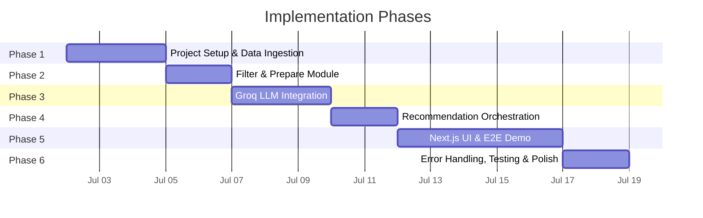
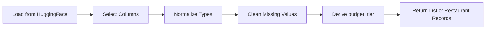
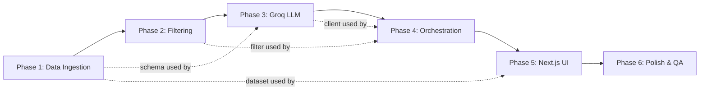

# Implementation Plan: AI-Powered Restaurant Recommendation System

> Phase-wise execution guide derived from [architecture.md](architecture.md) and [context.md](context.md).
> **LLM Provider:** Groq · **UI:** Next.js (React) · **Backend:** Python 3.10+ · **API:** FastAPI

---

## Phase Overview



| Phase | Focus | Key Deliverables | Est. Duration |
|-------|-------|-----------------|---------------|
| **1** | Project Setup & Data Ingestion | Scaffold, dataset load, preprocessing, cache | 2–3 days |
| **2** | Filter & Prepare Module | Deterministic filtering, candidate serialization, unit tests | 1–2 days |
| **3** | Groq LLM Integration | Prompt builder, Groq client, response parser | 2–3 days |
| **4** | Recommendation Orchestration | Service layer connecting filter → LLM → formatter | 1–2 days |
| **5** | Next.js UI & FastAPI Backend-for-Frontend | Next.js app, FastAPI endpoint, preference form, results view, wired E2E | 4–5 days |
| **6** | Error Handling, Testing & Polish | Fallbacks, edge cases, logging, final QA | 1–2 days |

---

## Phase 1: Project Setup & Data Ingestion

### 1.1 Objective

Set up the project scaffold, load the Zomato dataset from Hugging Face, preprocess it into a normalized schema, and cache it in memory for downstream use.

### 1.2 Tasks

#### 1.2.1 Project Scaffold

- [ ] Create the directory structure per [architecture §4](architecture.md):

```
zomato-recommendation/
├── docs/
├── src/
│   ├── __init__.py
│   ├── main.py
│   ├── config.py
│   ├── data/
│   │   ├── __init__.py
│   │   ├── ingestion.py
│   │   ├── schema.py
│   │   └── cache.py
│   ├── filtering/
│   │   ├── __init__.py
│   │   └── filter.py
│   ├── llm/
│   │   ├── __init__.py
│   │   ├── prompt_builder.py
│   │   ├── groq_client.py
│   │   └── parser.py
│   ├── services/
│   │   ├── __init__.py
│   │   └── recommendation.py
│   └── api/
│       ├── __init__.py
│       ├── routes.py
│       └── models.py
├── tests/
│   ├── __init__.py
│   ├── test_ingestion.py
│   ├── test_filter.py
│   └── test_recommendation.py
├── requirements.txt
├── .env.example
├── .gitignore
└── README.md
```

- [ ] Initialize `requirements.txt` with core dependencies:

```
datasets
pandas
groq
streamlit
pydantic
pydantic-settings
python-dotenv
pytest
```

- [ ] Create `.env.example`:

```env
GROQ_API_KEY=your_groq_api_key_here
GROQ_MODEL=llama-3.3-70b-versatile
GROQ_TEMPERATURE=0.3
MAX_CANDIDATES=20
TOP_K=5
DATASET_CACHE_PATH=
```

- [ ] Create `.gitignore` (exclude `.env`, `__pycache__`, `.venv`, etc.)

#### 1.2.2 Configuration Module

- [ ] Implement `src/config.py` using `pydantic-settings`:

```python
# Loads from .env and environment variables
class Settings(BaseSettings):
    groq_api_key: str
    groq_model: str = "llama-3.3-70b-versatile"
    groq_temperature: float = 0.3
    max_candidates: int = 20
    top_k: int = 5
    dataset_cache_path: str | None = None

    class Config:
        env_file = ".env"
```

#### 1.2.3 Data Schema

- [ ] Implement `src/data/schema.py` — define the normalized restaurant record:

| Field | Type | Source |
|-------|------|--------|
| `id` | `str` | Generated UUID or index-based |
| `name` | `str` | Dataset column |
| `location` | `str` | Dataset column (normalized) |
| `cuisine` | `str` | Dataset column |
| `rating` | `float` | Dataset column (parsed) |
| `cost_for_two` | `float` | Dataset column |
| `budget_tier` | `Literal["low", "medium", "high"]` | Derived from cost percentiles |
| `raw_metadata` | `dict` | Remaining columns |

- [ ] Use Python `dataclass` or `Pydantic BaseModel` for type safety.

#### 1.2.4 Data Ingestion Pipeline

- [ ] Implement `src/data/ingestion.py`:



**Key logic:**
1. Load dataset using `datasets.load_dataset("ManikaSaini/zomato-restaurant-recommendation")`
2. Inspect and map actual column names → normalized schema
3. Drop rows with missing `name` or `location`
4. Parse `rating` as float; exclude invalid values (outside 0–5)
5. Trim and title-case location strings
6. Compute budget tiers from `cost_for_two` distribution (tercile-based thresholds)
7. Generate stable `id` per row (e.g., `f"rest_{index}"`)

#### 1.2.5 Caching

- [ ] Implement `src/data/cache.py`:
  - In-memory singleton pattern — load once, reuse across requests
  - Optional: persist preprocessed data as JSON/Parquet to `DATASET_CACHE_PATH` for faster cold starts
  - Expose `get_all_restaurants() -> list[Restaurant]`

### 1.3 Verification

- [ ] Write `tests/test_ingestion.py`:
  - Test that dataset loads without errors
  - Test schema mapping produces valid `Restaurant` records
  - Test budget tier derivation logic
  - Test handling of missing/invalid rows
- [ ] Run ingestion manually and print summary stats:
  - Total restaurants loaded
  - Distribution of budget tiers
  - Sample records
  - Unique locations / cuisines

### 1.4 Exit Criteria

✅ `python -c "from src.data.cache import get_all_restaurants; print(len(get_all_restaurants()))"` prints the restaurant count  
✅ All `test_ingestion.py` tests pass  
✅ Budget tier distribution looks reasonable (roughly 33% each)

---

## Phase 2: Filter & Prepare Module

### 2.1 Objective

Build the deterministic filtering engine that narrows the full dataset to a candidate set based on user preferences, then serializes candidates for the LLM prompt.

### 2.2 Tasks

#### 2.2.1 Filter Logic

- [ ] Implement `src/filtering/filter.py`:

```python
def filter_restaurants(
    restaurants: list[Restaurant],
    location: str | None,
    cuisine: str | None,
    budget: str | None,       # "low" | "medium" | "high"
    min_rating: float = 0.0,
) -> list[Restaurant]:
```

**Filter chain (AND composition):**

| Filter | Logic | Matching |
|--------|-------|----------|
| Location | `user.location in restaurant.location` | Case-insensitive, partial/substring |
| Rating | `restaurant.rating >= user.min_rating` | Numeric comparison |
| Cuisine | Token match on comma-separated cuisines | Case-insensitive, any token match |
| Budget | `restaurant.budget_tier == user.budget` | Exact enum match |

- Each filter is optional — skip if the user didn't provide that preference
- Return the full dataset if no filters specified

#### 2.2.2 Candidate Preparation

- [ ] Implement candidate capping and serialization:
  - Sort filtered results by rating descending
  - Limit to `MAX_CANDIDATES` (default 20)
  - Serialize to compact JSON (only fields needed by LLM): `id`, `name`, `cuisine`, `rating`, `cost_for_two`, `location`

```python
def prepare_candidates(
    filtered: list[Restaurant],
    max_candidates: int = 20,
) -> tuple[list[dict], int]:
    """Returns (serialized candidates, total filtered count)."""
```

#### 2.2.3 Edge Case Handling

- [ ] Handle zero-match scenario:
  - Return empty list + metadata indicating which filters eliminated candidates
  - Suggest relaxation (e.g., "No Italian restaurants in Delhi — try broadening cuisine or location")

### 2.3 Verification

- [ ] Write `tests/test_filter.py`:
  - Location filter: exact match, partial match, case insensitivity
  - Cuisine filter: single cuisine, multi-cuisine restaurants
  - Budget filter: each tier
  - Rating filter: boundary cases (exact threshold)
  - Combination filters
  - Empty dataset edge case
  - No filters applied → returns all
  - Zero results scenario

### 2.4 Exit Criteria

✅ All `test_filter.py` tests pass  
✅ Can filter 1000+ restaurants to <20 candidates in <100ms  
✅ Zero-match path returns helpful metadata instead of silent empty list

---

## Phase 3: Groq LLM Integration

### 3.1 Objective

Build the prompt construction, Groq API client, and response parsing pipeline. By the end of this phase, the system can send a prompt with candidate restaurants and get back ranked, explained recommendations.

### 3.2 Tasks

#### 3.2.1 Prompt Builder

- [ ] Implement `src/llm/prompt_builder.py`:

**System prompt (template):**

```
You are an expert restaurant recommender. You MUST ONLY recommend
restaurants from the provided candidate list. Do NOT invent or 
hallucinate any restaurant not in the list.

Given the user's preferences and the candidate restaurants below,
rank the top {top_k} restaurants. For each, provide a concise 
1–2 sentence explanation of why it's a good match.

Respond ONLY in valid JSON with this exact structure:
{
  "summary": "A brief 1-2 sentence overview",
  "rankings": [
    {
      "restaurant_id": "string",
      "rank": integer,
      "explanation": "string"
    }
  ]
}
```

**User prompt (template):**

```
## My Preferences
- Location: {location}
- Budget: {budget}
- Cuisine: {cuisine}
- Minimum Rating: {min_rating}
- Additional: {additional_preferences}

## Candidate Restaurants
{candidates_json}

Please rank the top {top_k} from the list above.
```

- [ ] Implement `build_prompt(preferences, candidates, top_k) -> tuple[str, str]` returning `(system_prompt, user_prompt)`

#### 3.2.2 Groq Client

- [ ] Implement `src/llm/groq_client.py`:

```python
from groq import Groq

class GroqClient:
    def __init__(self, api_key: str, model: str, temperature: float):
        self.client = Groq(api_key=api_key)
        self.model = model
        self.temperature = temperature

    def get_recommendation(
        self, system_prompt: str, user_prompt: str
    ) -> str:
        """Returns raw JSON string from Groq."""
        completion = self.client.chat.completions.create(
            model=self.model,
            messages=[
                {"role": "system", "content": system_prompt},
                {"role": "user", "content": user_prompt},
            ],
            temperature=self.temperature,
            response_format={"type": "json_object"},
        )
        return completion.choices[0].message.content
```

- [ ] Add retry logic: 1 retry on transient errors (timeout, 5xx, rate limit)
- [ ] Log: model used, token counts, latency

#### 3.2.3 Response Parser & Validator

- [ ] Implement `src/llm/parser.py`:

```python
def parse_llm_response(
    raw_json: str,
    valid_ids: set[str],
) -> ParsedRecommendation:
    """Parse, validate, and clean LLM output."""
```

**Validation rules:**
1. Parse JSON — if malformed, raise `ParseError`
2. Verify `rankings` is a non-empty list
3. For each entry: `restaurant_id` must exist in `valid_ids`
4. Strip entries with unknown IDs (log a warning)
5. Re-number ranks if any were dropped

**Return type:**

```python
@dataclass
class RankedRestaurant:
    restaurant_id: str
    rank: int
    explanation: str

@dataclass
class ParsedRecommendation:
    summary: str
    rankings: list[RankedRestaurant]
```

### 3.3 Verification

- [ ] Manual test: hardcode a small candidate set, call Groq, print parsed result
- [ ] Unit tests for parser:
  - Valid JSON with all valid IDs
  - Valid JSON with some unknown IDs (should strip them)
  - Malformed JSON (should raise `ParseError`)
  - Empty rankings array
- [ ] Verify Groq API key works: `python -c "from src.llm.groq_client import GroqClient; ..."`

### 3.4 Exit Criteria

✅ `GroqClient.get_recommendation()` returns valid JSON from Groq  
✅ Parser correctly validates and cleans LLM output  
✅ All parser unit tests pass  
✅ End-to-end: candidates in → ranked recommendations out (via script)

---

## Phase 4: Recommendation Orchestration Service

### 4.1 Objective

Wire together the filter, prompt builder, Groq client, parser, and response formatter into a single orchestration service that accepts user preferences and returns fully formatted recommendations.

### 4.2 Tasks

#### 4.2.1 Response Formatter

- [ ] Implement response merging in `src/services/recommendation.py`:

```python
def merge_rankings(
    parsed: ParsedRecommendation,
    restaurants: list[Restaurant],
) -> list[RecommendationResult]:
    """Join LLM rankings with full restaurant records."""
```

**Output per recommendation:**

| Field | Source |
|-------|--------|
| `rank` | LLM |
| `name` | Dataset |
| `cuisine` | Dataset |
| `rating` | Dataset |
| `estimated_cost` | Dataset (`cost_for_two`) |
| `location` | Dataset |
| `explanation` | LLM |

#### 4.2.2 Orchestration Service

- [ ] Implement `src/services/recommendation.py`:

```python
class RecommendationService:
    def __init__(self, settings: Settings):
        self.data = get_all_restaurants()
        self.groq = GroqClient(...)
        self.settings = settings

    def recommend(self, preferences: UserPreferences) -> RecommendationResponse:
        # 1. Filter
        filtered = filter_restaurants(self.data, ...)
        
        # 2. Handle empty
        if not filtered:
            return empty_response_with_suggestion(preferences)
        
        # 3. Prepare candidates
        candidates, total = prepare_candidates(filtered, self.settings.max_candidates)
        
        # 4. Build prompt
        system_prompt, user_prompt = build_prompt(
            preferences, candidates, self.settings.top_k
        )
        
        # 5. Call Groq
        raw = self.groq.get_recommendation(system_prompt, user_prompt)
        
        # 6. Parse & validate
        parsed = parse_llm_response(raw, {c["id"] for c in candidates})
        
        # 7. Merge with dataset
        results = merge_rankings(parsed, self.data)
        
        # 8. Return
        return RecommendationResponse(
            summary=parsed.summary,
            recommendations=results,
            metadata={"candidates_considered": len(filtered), "filtered_from_total": len(self.data)}
        )
```

#### 4.2.3 Request / Response Models

- [ ] Implement `src/api/models.py` using Pydantic:

```python
class UserPreferences(BaseModel):
    location: str
    budget: Literal["low", "medium", "high"] | None = None
    cuisine: str | None = None
    min_rating: float = Field(default=0.0, ge=0.0, le=5.0)
    additional_preferences: str | None = None

class RecommendationResult(BaseModel):
    rank: int
    name: str
    cuisine: str
    rating: float
    estimated_cost: str
    location: str
    explanation: str

class RecommendationResponse(BaseModel):
    summary: str
    recommendations: list[RecommendationResult]
    metadata: dict
```

### 4.3 Verification

- [ ] Write `tests/test_recommendation.py`:
  - Mock `GroqClient` to return fixed JSON; verify full pipeline
  - Test empty filter → returns suggestion message without calling Groq
  - Test fallback when parser raises an error
- [ ] Manual integration test: call `RecommendationService.recommend()` with real preferences and print results

### 4.4 Exit Criteria

✅ `RecommendationService.recommend(prefs)` returns a complete `RecommendationResponse`  
✅ Mock-based integration tests pass  
✅ Real Groq call produces valid, merged recommendations  
✅ Empty-filter path returns helpful message without calling Groq

---

## Phase 5: Next.js UI & End-to-End Demo

### 5.1 Objective

Build a premium Next.js frontend and a lightweight FastAPI endpoint that serves the Python recommendation service. The UI collects user preferences via a modern form, calls the API, and displays AI-ranked results in a polished, responsive layout with dark-mode glassmorphism styling.

### 5.2 Tasks

#### 5.2.1 FastAPI Backend-for-Frontend

- [ ] Implement `src/api/routes.py` — a thin FastAPI app exposing the recommendation service:

```python
from fastapi import FastAPI
from fastapi.middleware.cors import CORSMiddleware
from src.api.models import UserPreferences, RecommendationResponse
from src.config import Settings
from src.services.recommendation import RecommendationService

app = FastAPI(title="AI Restaurant Recommender API")
app.add_middleware(CORSMiddleware, allow_origins=["*"], allow_methods=["*"], allow_headers=["*"])

service = RecommendationService(Settings())

@app.post("/api/recommend", response_model=RecommendationResponse)
def recommend(prefs: UserPreferences):
    return service.recommend(prefs)

@app.get("/api/options")
def get_filter_options():
    """Return unique locations and cuisines for the form dropdowns."""
```

- [ ] Add `fastapi` and `uvicorn` to `requirements.txt`
- [ ] Verify with: `uvicorn src.api.routes:app --reload`

#### 5.2.2 Next.js Project Scaffold

- [ ] Initialize a Next.js app inside `frontend/`:

```
frontend/
├── public/
├── src/
│   ├── app/
│   │   ├── layout.tsx        # Root layout with metadata, fonts, global CSS
│   │   ├── page.tsx          # Home page (recommendation UI)
│   │   └── globals.css       # Global styles & CSS variables
│   ├── components/
│   │   ├── HeroSection.tsx          # Hero header with gradient title
│   │   ├── PreferenceForm.tsx       # Sidebar/form for user input
│   │   ├── RestaurantCard.tsx       # Single result card
│   │   ├── ResultsSection.tsx       # Results container + stats
│   │   ├── EmptyState.tsx           # No-results / welcome state
│   │   └── FallbackBanner.tsx       # Warning banner for fallback mode
│   ├── lib/
│   │   └── api.ts            # Fetch wrapper for /api/recommend
│   └── types/
│       └── index.ts          # TypeScript interfaces matching API models
├── package.json
├── tsconfig.json
└── next.config.ts
```

- [ ] Use `npx -y create-next-app@latest ./frontend` (TypeScript, App Router, vanilla CSS)
- [ ] Install Google Font **Inter** via `next/font/google`

#### 5.2.3 Design System & Global Styles (`globals.css`)

- [ ] Define a dark-mode CSS variable palette:

| Token | Value | Purpose |
|-------|-------|--------|
| `--bg-primary` | `#0a0a0f` | Page background |
| `--bg-card` | `rgba(255,255,255,0.04)` | Glassmorphism card fill |
| `--glass-border` | `rgba(255,255,255,0.08)` | Subtle card borders |
| `--accent-gradient` | `linear-gradient(135deg, #f97316, #ef4444, #ec4899)` | Brand gradient |
| `--text-primary` | `#f0f0f5` | Main text |
| `--text-secondary` | `#9898a8` | Supporting text |
| `--accent-violet` | `#8b5cf6` | Explanation accent |

- [ ] Add micro-animations: card hover lift, gradient shimmer on hero title, pulse for welcome icon
- [ ] Ensure fully responsive layout (mobile → desktop)

#### 5.2.4 Preference Form Component

- [ ] Build `PreferenceForm.tsx` with the following inputs:

| Input | Element | Validation |
|-------|---------|------------|
| Location | `<select>` populated from `/api/options` | Required, non-empty |
| Budget | `<select>` with `["Any", "low", "medium", "high"]` | Enum |
| Cuisine | Multi-select or searchable dropdown from `/api/options` | Optional |
| Min Rating | Range slider (0.0 – 5.0, step 0.5) | Float |
| Additional | `<textarea>` | Optional, free text |

- [ ] Fetch dropdown options from `/api/options` on mount
- [ ] Show inline validation errors for empty location
- [ ] Disable submit button and show loading state during API call

#### 5.2.5 Results Display

- [ ] **Loading state**: skeleton cards or animated spinner during API call
- [ ] **Summary banner**: gradient-bordered card showing the AI summary
- [ ] **Stats pills**: "Top N picks · Considered X candidates · From Y total"
- [ ] **RestaurantCard** — glassmorphism card layout per result:

```
┌─────────────────────────────────────────┐
│ 🥇 #1 — Restaurant Name                │
│ 🍽️ Cuisine: Italian                     │
│ ⭐ Rating: 4.5 / 5  (star icons)        │
│ 💰 Cost for Two: ₹800                   │
│ 📍 Location: Indiranagar, Bangalore     │
│                                         │
│ 💬 "Highly rated for authentic pasta    │
│     and a relaxed family atmosphere."   │
└─────────────────────────────────────────┘
```

- [ ] Rank badges: gradient backgrounds (#1 orange→red, #2 violet, #3 sky, etc.)
- [ ] Hover effect: `translateY(-2px)`, border glow, top gradient bar reveal
- [ ] Show metadata footer: source label + "no hallucinated restaurants"

#### 5.2.6 Empty & Error States

- [ ] **No matches**: animated empty-state card with relaxation suggestions from the API
- [ ] **Fallback mode**: amber warning banner ("AI rankings temporarily unavailable")
- [ ] **API / network error**: error card with retry button
- [ ] **Welcome state** (before first search): animated icon + instructions

#### 5.2.7 SEO & Performance

- [ ] Set `<title>` and `<meta description>` via Next.js `metadata` export
- [ ] Use semantic HTML: `<main>`, `<aside>`, `<article>`, single `<h1>`
- [ ] Lazy-load result cards if list is long
- [ ] Ensure all interactive elements have unique IDs

### 5.3 Verification

- [ ] Start FastAPI: `uvicorn src.api.routes:app --reload` (port 8000)
- [ ] Start Next.js: `cd frontend && npm run dev` (port 3000)
- [ ] Test end-to-end flow:
  - Submit valid preferences → see ranked cards with AI explanations
  - Submit filters that yield no matches → see empty state with suggestions
  - Various location / cuisine / budget combos
- [ ] Verify loading skeleton appears during API call
- [ ] Verify results contain only real dataset restaurants
- [ ] Test responsive layout at mobile, tablet, and desktop widths
- [ ] Check dark-mode styling renders correctly

### 5.4 Exit Criteria

✅ FastAPI `/api/recommend` endpoint returns correct `RecommendationResponse`  
✅ Next.js app launches without errors (`npm run dev`)  
✅ Full flow: form → API call → parsed results → rendered cards  
✅ Empty state, loading state, fallback state, and error state all work  
✅ Results contain real restaurant data with AI explanations  
✅ UI feels premium: glassmorphism cards, smooth animations, responsive layout  
✅ SEO metadata is present and correct

---

## Phase 6: Error Handling, Testing & Polish

### 6.1 Objective

Harden the application with comprehensive error handling, fallback paths, logging, and final quality assurance.

### 6.2 Tasks

#### 6.2.1 Fallback Logic

- [ ] Implement fallback in `RecommendationService`:

| Failure | Fallback Action |
|---------|----------------|
| Groq timeout / rate limit | Retry once → return top N by rating with template explanations |
| Invalid JSON from LLM | Retry with stricter prompt → rating-based fallback |
| Empty LLM rankings | Sort by rating, attach default explanation |
| Dataset load failure | Show "service unavailable" message |

- [ ] Create template explanation generator:

```python
def generate_template_explanation(restaurant: Restaurant) -> str:
    return (
        f"A {restaurant.budget_tier}-budget {restaurant.cuisine} restaurant "
        f"in {restaurant.location} with a {restaurant.rating}/5 rating."
    )
```

#### 6.2.2 Input Validation

- [ ] Validate all user inputs server-side (FastAPI endpoint):
  - Location: non-empty, sanitized string
  - Budget: must be one of `low`, `medium`, `high`
  - Min rating: float between 0 and 5
  - Cuisine: sanitized string
- [ ] Block prompt injection via additional_preferences (strip control characters, limit length)

#### 6.2.3 Logging & Observability

- [ ] Add structured logging throughout:

| Event | Logged Data |
|-------|-------------|
| Request received | Preferences (redacted if needed) |
| Filter completed | Candidates found, total dataset size |
| Groq call start | Model, prompt token estimate |
| Groq call complete | Latency (ms), token usage |
| Parse result | Rankings count, any stripped IDs |
| Fallback triggered | Failure type, fallback method |

- [ ] Use Python `logging` with consistent format

#### 6.2.4 Comprehensive Testing

- [ ] Finalize test suite:

| Test File | Coverage |
|-----------|----------|
| `test_ingestion.py` | Dataset load, schema mapping, budget tier, missing values |
| `test_filter.py` | All filter combos, edge cases, zero results |
| `test_recommendation.py` | Full pipeline (mocked Groq), fallback paths, empty filter |
| `test_parser.py` | Valid/invalid JSON, unknown IDs, empty rankings |

- [ ] Run full test suite: `pytest tests/ -v`

#### 6.2.5 Documentation

- [ ] Complete `README.md`:
  - Project description and features
  - Setup instructions (Python version, virtual env, dependencies)
  - Environment variable configuration
  - How to run (FastAPI backend + Next.js frontend)
  - Screenshots of the UI
  - Architecture overview (link to docs)

- [ ] Finalize `.env.example` with all variables and comments

#### 6.2.6 Final QA Checklist

- [ ] End-to-end test with 5+ different preference combinations
- [ ] Verify no hallucinated restaurants (every result maps to dataset)
- [ ] Test with Groq API key revoked → confirm fallback works
- [ ] Test with unusual inputs (empty strings, special characters, very long text)
- [ ] Confirm `.env` is not committed to git
- [ ] Code review: remove debug prints, clean up imports, consistent style

### 6.3 Verification

- [ ] `pytest tests/ -v` → all tests pass
- [ ] Manual E2E testing: 5+ scenarios produce correct, well-formatted results
- [ ] Fallback paths tested by simulating failures
- [ ] README is complete and accurate

### 6.4 Exit Criteria

✅ All unit and integration tests pass  
✅ Fallback behavior works for every failure scenario  
✅ Logging captures key events without sensitive data leaks  
✅ README provides clear setup and run instructions  
✅ Application handles edge cases gracefully

---

## Dependencies Between Phases



> **Note:** Phases are sequential with soft dependencies shown as dashed lines. Each phase builds on the previous one's output.

---

## Risk Mitigation

| Risk | Likelihood | Impact | Mitigation |
|------|-----------|--------|------------|
| Hugging Face dataset schema differs from expected | Medium | High | Phase 1 starts with dataset inspection; schema is adapted dynamically |
| Groq rate limits exceeded during development | Low | Medium | Use small candidate sets during testing; cache Groq responses for repeated tests |
| LLM produces inconsistent JSON structure | Medium | Medium | Strict prompt design + JSON mode + parser validation + fallback |
| Dataset has very few restaurants for certain locations | Medium | Low | Graceful empty-state messaging; suggest filter relaxation |
| Groq model deprecated or removed | Low | High | Config-driven model selection; easy to swap via `GROQ_MODEL` env var |

---

## Quick Reference: Key Files by Phase

| Phase | Primary Files |
|-------|--------------|
| 1 | `config.py`, `data/ingestion.py`, `data/schema.py`, `data/cache.py`, `requirements.txt` |
| 2 | `filtering/filter.py`, `tests/test_filter.py` |
| 3 | `llm/prompt_builder.py`, `llm/groq_client.py`, `llm/parser.py` |
| 4 | `services/recommendation.py`, `api/models.py`, `tests/test_recommendation.py` |
| 5 | `src/api/routes.py` (FastAPI), `frontend/` (Next.js app) |
| 6 | All files (hardening pass), `README.md`, `tests/*` |

---

*This plan should be executed sequentially. Each phase includes its own verification steps — do not proceed to the next phase until exit criteria are met.*
